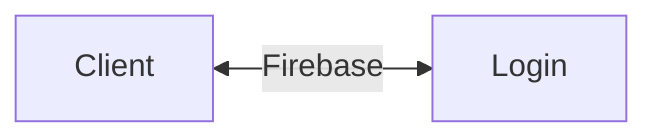
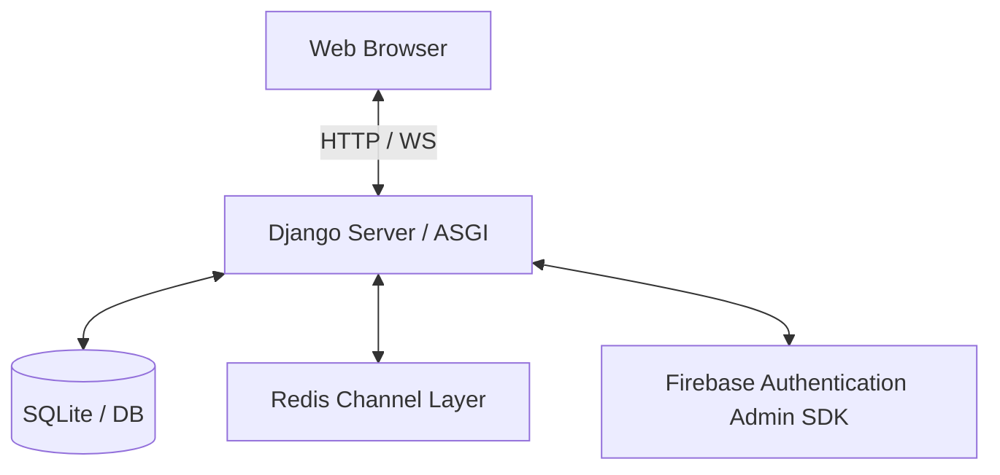

# System Architecture

## Architecture Overview
LazyOne is a Django-based application using a model-view-template (MVT) architecture extended with Django Channels for WebSocket routing.

## Core Components
- **Django Core**: Handles routing, views, authentication, templating, and server administration.
- **Django Channels (ASGI)**: Manages incoming WebSocket connections for active real-time chats.
- **Redis Channel Layer**: Back-end message broker that coordinates communication between websocket instances.
- **Firebase Auth**: Verifies ID tokens sent by the client for secure user onboarding and verification.
- **SQLite Database**: Local schema representation containing relational tables for `UserProfile`, `Task`, `FriendRequest`, `Friendship`, `Conversation`, and `Notification`.
